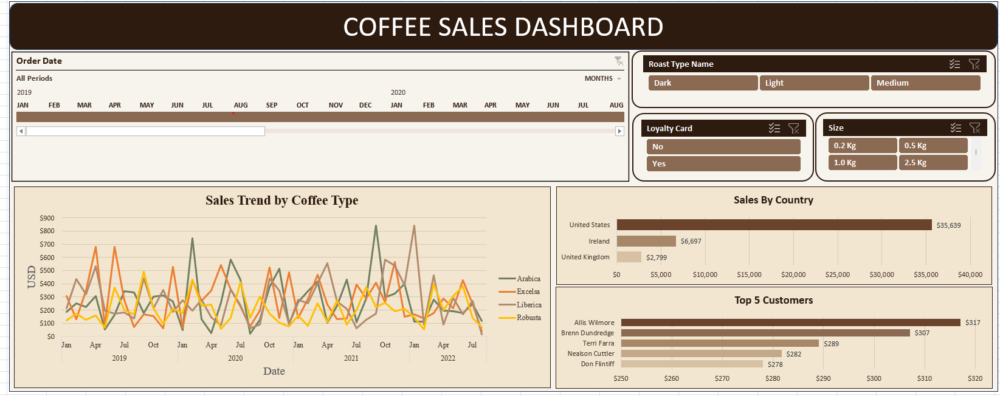

# Coffee Sales Dashboard — Excel

An interactive **Coffee Sales Dashboard built in Microsoft Excel** to analyze coffee sales performance across time, countries, customers, roast types, loyalty-card status, and product sizes.

The project transforms raw transaction data into a clean, interactive dashboard that makes sales trends and business comparisons easier to understand.

---

## 📊 Dashboard Preview

---

## 🎯 Problem Statement

Raw sales transaction data can contain a large number of records, making it difficult to quickly answer important business questions such as:

- How are sales changing over time?
- Which countries generate the highest sales?
- Who are the top customers?
- How does sales performance vary by coffee type?
- How do sales change based on roast type, loyalty-card status, and product size?
- Can these insights be explored from a single dashboard?

A simple table of transactions makes this analysis time-consuming. Therefore, an interactive visual solution is required to make the data easier to explore and understand.

---

## 💡 Solution

I developed an **interactive Coffee Sales Dashboard in Microsoft Excel** using PivotTables, PivotCharts, a Timeline, and Slicers.

The dashboard allows users to filter the data and dynamically analyze sales performance across different dimensions.

### Dashboard Features

📈 **Sales Trend by Coffee Type**  
Tracks monthly sales trends for Arabica, Excelsa, Liberica, and Robusta.

🌍 **Sales by Country**  
Compares total sales across different countries.

👥 **Top 5 Customers**  
Highlights the customers generating the highest sales.

📅 **Order Date Timeline**  
Allows users to analyze sales across different time periods.

☕ **Roast Type Filter**  
Filter the dashboard based on Dark, Light, or Medium roast.

💳 **Loyalty Card Filter**  
Compare sales from customers with or without a loyalty card.

⚖️ **Size Filter**  
Filter sales based on product size.

---

## 🔍 Key Insights

The dashboard makes it possible to quickly identify:

- The **United States** as the highest-sales country among the displayed countries.
- The highest-value customers through the **Top 5 Customers** analysis.
- Monthly fluctuations in sales across different coffee types.
- Changes in sales performance when applying different filters.
- Trends across different time periods using the interactive timeline.

Because the dashboard is interactive, these insights can change dynamically based on the selected filters.

---

## 🛠️ Tools & Techniques

| Tool / Technique | Purpose |
|---|---|
| Microsoft Excel | Dashboard development |
| PivotTables | Data aggregation and analysis |
| PivotCharts | Interactive data visualization |
| Timeline | Date-based filtering |
| Slicers | Interactive filtering |
| Data Formatting | Currency and readable values |
| Dashboard Design | Layout, alignment, spacing, and visual hierarchy |

---

## 🎨 Dashboard Design

The dashboard was designed with a **coffee-inspired professional theme**.

The design focuses on:

- Clean visual hierarchy
- Consistent spacing
- Proper alignment
- Rounded dashboard cards
- Coffee-inspired colors
- Clear chart titles
- Readable labels
- Interactive filters
- Minimal visual clutter

### Color Palette

| Color | HEX |
|---|---|
| Espresso | `#2E1B10` |
| Dark Brown | `#4A3A30` |
| Mocha | `#8A6A52` |
| Light Mocha | `#B28A6E` |
| Cream | `#F7F3ED` |
| Chart Cream | `#F2E6D0` |
| Soft Beige | `#E4D5BC` |
| Sage Green | `#6F8060` |
